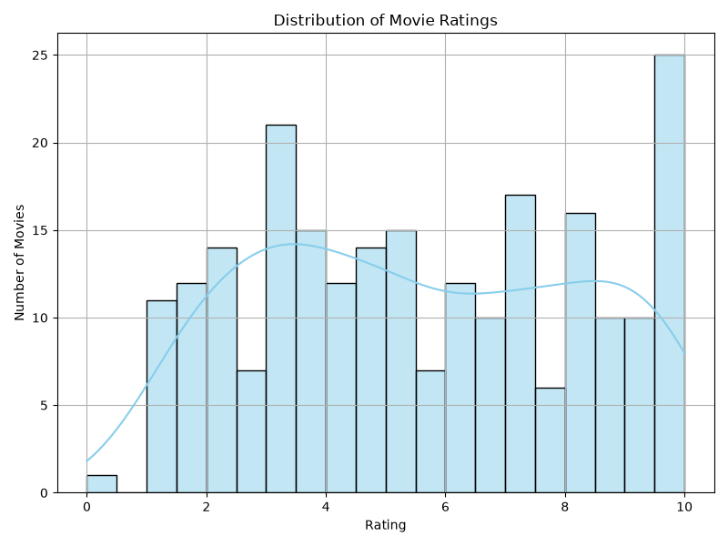
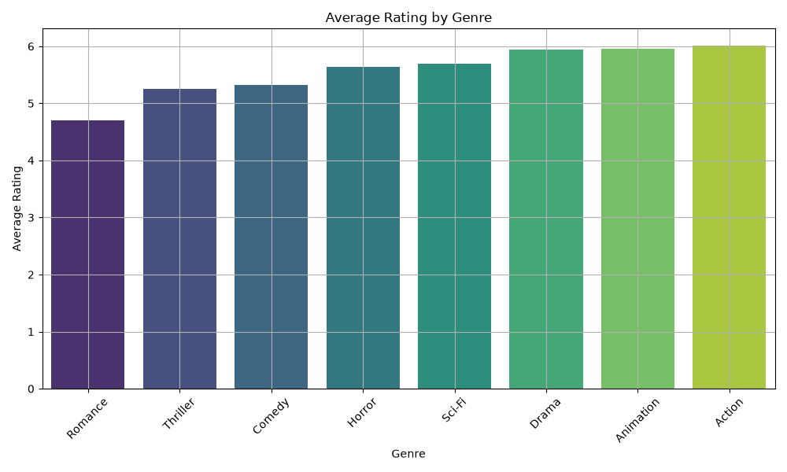
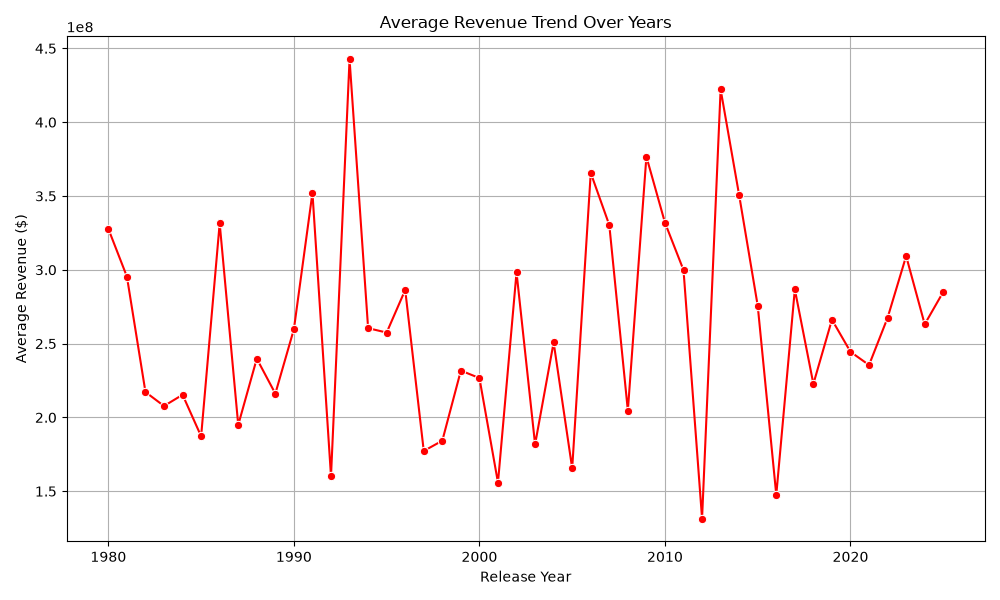
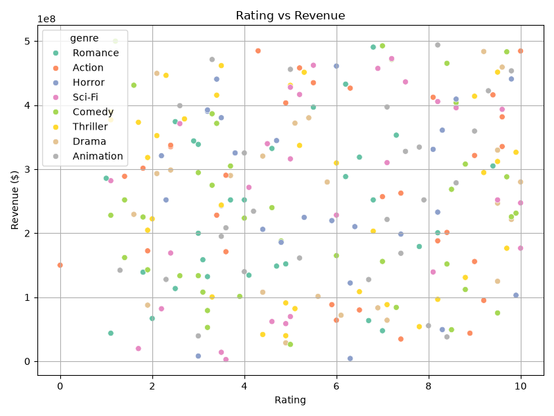
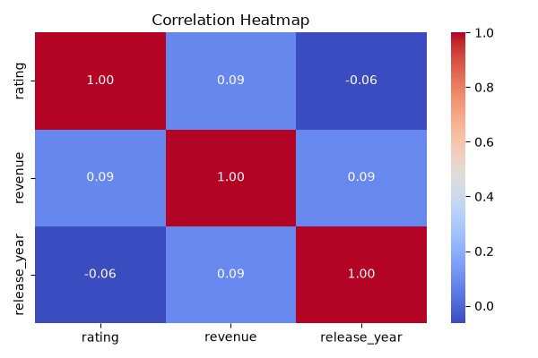

# Movie Rating Analysis

An end-to-end Python and SQLite data analysis project exploring movie ratings, genres, release years, and box-office revenue trends.

---

## Project Structure

```text
Movie_rating_analysis/
├── data/
│   ├── movies.csv
│   └── movies_cleaned.csv
├── database/
│   └── movies.db
├── notebooks/
│   └── movie_analysis.ipynb
├── plots/
│   ├── correlation_heatmap.png
│   ├── genre_ratings.png
│   ├── rating_distribution.png
│   ├── rating_vs_revenue.png
│   └── revenue_trends.png
├── scripts/
│   ├── generate_data.py
│   ├── create_database.py
│   ├── import_data.py
│   ├── data_cleaning.py
│   ├── sql_queries.py
│   └── visualization.py
├── requirements.txt
└── README.md
```

---

## Getting Started

### 1. Install Dependencies

Ensure Python 3.10+ is installed, then install required packages:

```bash
make install
```

### 2. Run the Pipeline

You can run the entire pipeline with a single command:

```bash
make pipeline
```

Or execute individual steps using `make` or Python:

```bash
make generate-data
make init-db
make import-data
make clean-data
make queries
make visualize
```

```bash
python scripts/generate_data.py
python scripts/create_database.py
python scripts/import_data.py
python scripts/data_cleaning.py
python scripts/sql_queries.py
python scripts/visualization.py
```

### 3. Interactive Notebook

To explore the data interactively:

```bash
jupyter notebook notebooks/movie_analysis.ipynb
```

---

## Analytical Insights

- **Top 10 Highest Rated Movies (post-2000)**
- **Average Rating by Genre**
- **Top 5 Highest Revenue Movies**
- **Movies Rated Above 8.0**
- **Decade-by-Decade Movie Release Counts**

---

## 📈 Sample Visualizations

The automated pipeline generates key analytical charts saved to the [`plots/`](plots/) directory:

### 1. Distribution of Movie Ratings
Histogram with KDE curve displaying the spread and frequency of ratings across the movie catalog.



### 2. Average Rating by Genre
Bar chart highlighting average ratings across genres such as Action, Drama, Comedy, Sci-Fi, and Romance.



### 3. Average Revenue Trend Over Years
Historical timeline tracking average box-office revenue trends across release years.



### 4. Rating vs. Revenue
Scatter plot analyzing the correlation between movie ratings and revenue, grouped by genre.



### 5. Correlation Heatmap
Correlation matrix examining numerical relationships among movie rating, revenue, and release year.



